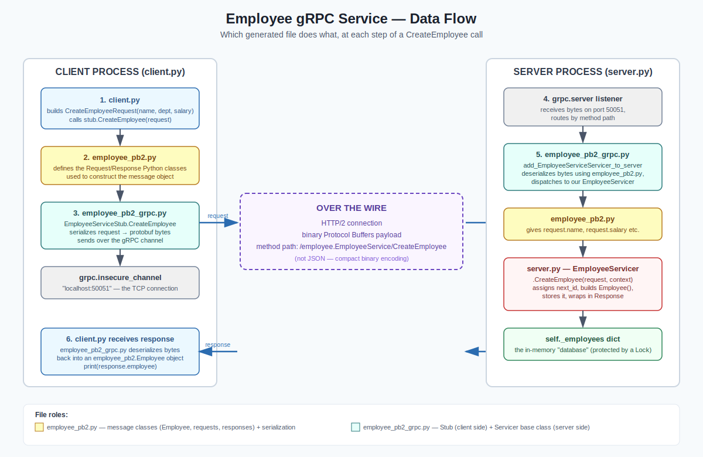

# Employee gRPC Service (Learning Project)

A minimal but complete gRPC CRUD service in Python, built to learn gRPC concepts hands-on.
Employees are stored **in memory** (a Python dict) — no database involved, on purpose, so the
focus stays on the gRPC mechanics.

---

## 1. What is gRPC, in short

gRPC is a framework for calling functions on a remote server as if they were local functions.

- You define a **contract** (`.proto` file) describing your data (`messages`) and your remote
  functions (`service` + `rpc` methods).
- A compiler (`protoc`) generates code in your language of choice from that contract — both
  message classes and client/server networking code.
- Under the hood, gRPC runs over **HTTP/2** and encodes data as **Protocol Buffers** (a compact
  binary format), not JSON. This makes it faster and smaller on the wire than typical REST/JSON,
  at the cost of the payload no longer being human-readable without the schema.
- Compare to REST: instead of designing URLs (`POST /employees`) and loosely-typed JSON bodies,
  you get strongly-typed request/response objects and real method names (`CreateEmployee(...)`),
  checked at compile time in the client and server code.

---

## 2. Project structure

```
employee-grpc/
├──.venv/
├── proto/
│   └── employee.proto          ← the contract: messages + service definition
├── server/
│   ├── employee_pb2.py         ← generated: message classes
│   ├── employee_pb2_grpc.py    ← generated: servicer base class + client stub
│   └── server.py                ← our server implementation (in-memory CRUD)
├── client/
│   ├── employee_pb2.py         ← generated (copy of the same file)
│   ├── employee_pb2_grpc.py    ← generated (copy of the same file)
│   └── client.py                ← simple hardcoded-values client, exercises full CRUD
│     
└── data-flow-diagram.svg    ← diagram of a request/response round trip
```

> The generated `employee_pb2*.py` files are duplicated in `server/` and `client/` here for
> simplicity. In a larger project you'd typically generate them once into a shared package that
> both sides import, or generate them independently in each service's own build step.

---

## 3. The `.proto` file — the contract

```protobuf
syntax = "proto3";
package employee;

message Employee {
  int32 id = 1;
  string name = 2;
  string department = 3;
  double salary = 4;
}

message CreateEmployeeRequest { string name = 1; string department = 2; double salary = 3; }
message CreateEmployeeResponse { Employee employee = 1; }

message GetEmployeeRequest { int32 id = 1; }
message GetEmployeeResponse { Employee employee = 1; }

message UpdateEmployeeRequest { int32 id = 1; string name = 2; string department = 3; double salary = 4; }
message UpdateEmployeeResponse { Employee employee = 1; }

message DeleteEmployeeRequest { int32 id = 1; }
message DeleteEmployeeResponse { bool success = 1; }

service EmployeeService {
  rpc CreateEmployee(CreateEmployeeRequest) returns (CreateEmployeeResponse);
  rpc GetEmployee(GetEmployeeRequest) returns (GetEmployeeResponse);
  rpc UpdateEmployee(UpdateEmployeeRequest) returns (UpdateEmployeeResponse);
  rpc DeleteEmployee(DeleteEmployeeRequest) returns (DeleteEmployeeResponse);
}
```

Key points:

- **Field numbers** (`= 1`, `= 2`, ...) are not default values — they identify each field in the
  binary wire encoding. They must stay stable once clients depend on them; renaming a field is
  safe, renumbering it is a breaking change.
- Every RPC has its **own request and response message**, even for simple operations. This is
  idiomatic gRPC — it means you can add new fields to `CreateEmployeeRequest` later without
  touching the method signature or breaking old clients.
- All four RPCs here are **unary**: one request in, one response out — the simplest gRPC call
  shape, and a direct match for CRUD operations. gRPC also supports streaming (client-streaming,
  server-streaming, bidirectional) for cases like `ListEmployees` returning many records — not
  used here, but a natural next step.

---

## 4. Compiling the `.proto` file

```bash
python3 -m grpc_tools.protoc \
  -I proto \
  --python_out=server \
  --grpc_python_out=server \
  proto/employee.proto
```

- `-I proto` — where to look for `.proto` files (the import path)
- `--python_out` — generates the message classes → `employee_pb2.py`
- `--grpc_python_out` — generates the service stub/servicer classes → `employee_pb2_grpc.py`

This produces two files, each with a distinct job:

| File | Contains | Used by |
|---|---|---|
| `employee_pb2.py` | Python classes for every `message` in the `.proto` (e.g. `Employee`, `CreateEmployeeRequest`), plus binary serialize/deserialize logic | Both client and server — anywhere a message needs to be built or read |
| `employee_pb2_grpc.py` | `EmployeeServiceStub` (client-side proxy for calling RPCs) and `EmployeeServiceServicer` (server-side base class to subclass), plus `add_EmployeeServiceServicer_to_server` glue | Client imports the **Stub**; server imports the **Servicer** and the glue function |

You never hand-edit these generated files — if the `.proto` changes, you just re-run `protoc`.

---

## 5. The server (`server/server.py`)

- Subclasses `EmployeeServiceServicer` and overrides all four RPC methods (the generated base
  class stubs them out with an `UNIMPLEMENTED` error — overriding replaces that with real logic).
- Stores employees in `self._employees` (a plain dict) plus a `self._next_id` counter.
- Uses a `threading.Lock()` around all reads/writes, because `grpc.server(...)` runs on a thread
  pool (`ThreadPoolExecutor`) — multiple requests can be handled concurrently, so the shared dict
  needs protection from race conditions.
- Signals errors via `context.set_code(grpc.StatusCode.NOT_FOUND)` and
  `context.set_details(...)`, gRPC's equivalent of an HTTP status code — not a raised Python
  exception on the server side.
- `add_insecure_port("[::]:50051")` binds the server to all network interfaces on port 50051,
  with no TLS (fine for local learning; production would use `add_secure_port` with certificates).
- `wait_for_termination()` blocks the main thread indefinitely so the process stays alive to keep
  handling requests (actual request handling happens on the background thread pool).

## 6. The client

Two versions, same underlying calls:

- **`client.py`** — hardcoded values, walks through Create → Get → Update → Delete → Get (expects
  a NOT_FOUND error) in one run. Good for seeing the whole lifecycle at a glance.
- **`interactive_client.py`** — a simple menu loop using `input()` so you can create/get/update/
  delete employees interactively without editing code each time.

Both create a `grpc.insecure_channel("localhost:50051")` (the connection) and wrap it in an
`EmployeeServiceStub` (the callable proxy). Calling `stub.CreateEmployee(request)` looks like a
normal function call — the serialization, network transport, and deserialization are all hidden
behind it.

Client-side errors surface as Python exceptions (`grpc.RpcError`), even though the server never
raised one — gRPC translates a non-OK status code into an exception automatically on the client:

```python
try:
    stub.GetEmployee(employee_pb2.GetEmployeeRequest(id=employee_id))
except grpc.RpcError as e:
    print(e.code(), e.details())
```

---

## 7. Data flow diagram

See [`data-flow-diagram.svg`](./data-flow-diagram.svg) for a visual walkthrough of a single
`CreateEmployee` call, showing exactly which generated file does what at each step:



1. `client.py` builds a `CreateEmployeeRequest`
2. `employee_pb2.py` provides that message class
3. `employee_pb2_grpc.py`'s `EmployeeServiceStub` serializes it and sends it over the channel
4. The server's `grpc.server` receives the bytes and routes by method path
5. `employee_pb2_grpc.py`'s generated glue deserializes (using `employee_pb2.py`) and dispatches
   to our `EmployeeServicer`
6. `server.py`'s `CreateEmployee` method runs the actual logic against the in-memory dict
7. The response travels back the same path in reverse

---

## 8. Running it

Terminal 1 — start the server:

```bash
source .venv/bin/activate
cd server
python3 server.py
# Employee gRPC server running on port 50051...
```

Terminal 2 — run a client:

```bash
source .venv/bin/activate
cd client
python3 client.py                # scripted CRUD walkthrough

```

---

